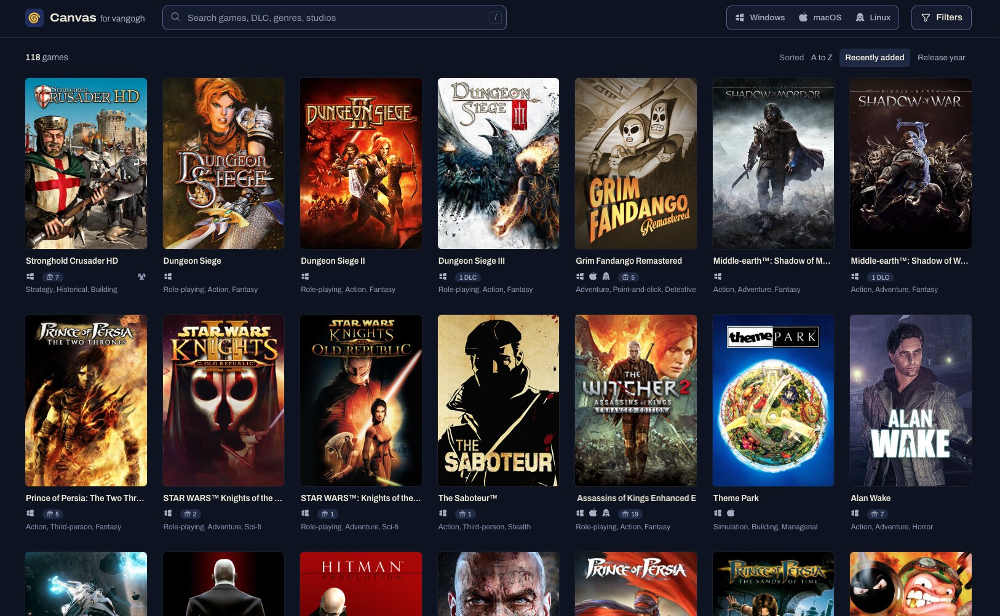
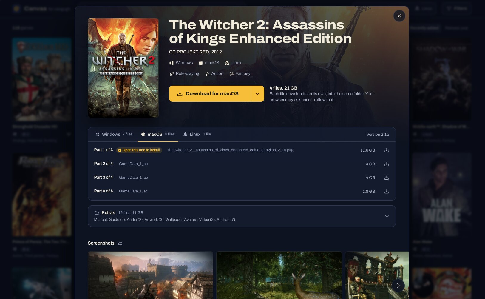

# Canvas

A web frontend for a GOG library archived by
[vangogh](https://github.com/arelate/vangogh). Canvas shows the owned games
as a wall of posters, searches them while you type, and hands out the
installers. It only reads: syncing and administration stay in vangogh.

Open it in a browser and you see the library. A click on a poster opens the
game: one button downloads the installer for the computer you sit at, part
by part if it has parts, and the page says which file to open afterwards.
The arrow beside the button downloads the installer for another system.

| The library | A game |
|---|---|
|  |  |

## Canvas and GOG.com games sharing guidelines

Canvas assumes you follow GOG.com's
[games sharing guidelines](https://support.gog.com/hc/en-us/articles/212184489-Can-I-share-games-with-others-?product=gog).
Like GOG.com and vangogh, it trusts you not to abuse this.

## What it needs

- A running vangogh that Canvas can reach over HTTP. Canvas was tested
  with vangogh 1.2.18; other versions were not checked.
- A vangogh account of role `user`. Create it on the host of vangogh:

  ```bash
  docker exec vangogh vangogh users -create -username api -password '<password>' -role user
  docker restart vangogh
  ```

- Docker.

## Keep the account safe

The account that Canvas uses reads the whole archive through vangogh's API.
Treat its password like the GOG login itself.

- Use an account made only for Canvas.
- Do not give vangogh accounts to other people.
- Keep vangogh itself reachable from the home network only.

Canvas never passes vangogh's API on to a browser. A browser can only ask
for an image by a checked id, or for a file that Canvas's own index names.
The password and the login token of the account are never logged.

## Extras

Canvas shows a game's extras (manuals, soundtracks, artwork and the rest
of GOG's goodies) when vangogh mirrors them. vangogh does by default.
`-no-extras`, or the variable `VANGOGH_NO-EXTRAS` with any value at all,
turns them off, and `false` does not turn them back on: remove the
variable. After turning them on, `vangogh get-downloads -missing` fetches
the extras of games synced before, since a sync downloads only what
changed. Canvas finds the new extras with its next rebuild.

## Settings

All settings are environment variables.

| Variable | Meaning | Default |
|---|---|---|
| `VANGOGH_URL` | Address of vangogh, such as `http://vangogh.lan:1853` | required |
| `VANGOGH_USERNAME` | The account | required |
| `VANGOGH_PASSWORD` | Its password | required |
| `REBUILD_AT` | Time of the daily rebuild, `HH:MM` | `04:30` |
| `TZ` | Time zone of `REBUILD_AT` and of the times Canvas shows | `UTC` |
| `CACHE_DIR` | Folder for the cached index | `/cache` |
| `PORT` | Port inside the container | `1854` |

The repository's `compose.yml` names two more: `CANVAS_PORT`, the port
on the host, and `SHUTDOWN_TIMEOUT`, the number of seconds (default `5`)
that Canvas waits for open connections when it is asked to stop.

`REBUILD_AT` belongs after vangogh's own sync. Canvas can show only what
vangogh has, and vangogh's API does not say when a sync ran. With vangogh
syncing at 03:30, the default of 04:30 gives it an hour.

Canvas refuses to start when a required variable is missing, and says which.
`docker compose` refuses too, before it starts anything. `VANGOGH_URL` must
not hold a username or a password.

A password with a `$` in it: in the `.env` file of compose, write each `$` as
`$$` (or put the whole value in single quotes), since compose reads `$name`
there as a variable. How Portainer treats a `$` in a stack variable was
not checked. The safe choice is a password without `$` for this account.

After every deployment, look at `/healthz`. `"login":"ok"` means the
password arrived as it should. `"login":"rejected"` means vangogh refused
it: the password is wrong, or a character in it was changed on the way.
`"login":"unknown"` means vangogh has not answered a login yet: it is not
reachable from Canvas, or Canvas has just started.

## Run it

Canvas is an image on GHCR, `ghcr.io/shai66/vangogh-canvas`, for amd64
and arm64. `latest` is the newest version, `0.7` the newest of that line,
`0.7.0` one version. A `compose.yml`, with the address of your vangogh
in `VANGOGH_URL`:

```yaml
services:
  canvas:
    image: ghcr.io/shai66/vangogh-canvas:latest
    container_name: vangogh-canvas
    restart: unless-stopped
    ports:
      - "1854:1854"
    environment:
      VANGOGH_URL: http://vangogh.lan:1853
      VANGOGH_USERNAME: ${VANGOGH_USERNAME:?set VANGOGH_USERNAME in .env}
      VANGOGH_PASSWORD: ${VANGOGH_PASSWORD:?set VANGOGH_PASSWORD in .env}
    volumes:
      - canvas-cache:/cache
    read_only: true
    tmpfs:
      - /tmp
    security_opt: ["no-new-privileges:true"]
    cap_drop: ["ALL"]

volumes:
  canvas-cache:
```

With the account in a file `.env` next to it (`VANGOGH_USERNAME=api` and
`VANGOGH_PASSWORD=...`):

```bash
docker compose up -d
curl http://127.0.0.1:1854/healthz
```

The first answer is `503` with `"status":"no-index"`. After the first
rebuild, within a few seconds, it is `200` with `"status":"ok"`.

The container runs as the user `node`, with a read-only file system, no
capabilities and `no-new-privileges`. It writes only to the volume
`canvas-cache` and to `/tmp`.

Canvas rebuilds the library at start, and then once a day at or after
`REBUILD_AT`. When the container starts after that time, the rebuild at start
counts as the rebuild of that day.

## Run it next to vangogh

`examples/compose.vangogh-stack.yml` runs vangogh and Canvas in one stack:
vangogh's minimal service from its wiki, and Canvas with `VANGOGH_URL`
pointing at the service name, so no host address is needed. The order
matters:

1. Copy the file into a folder of its own as `compose.yml`, and put the
   account for Canvas into `.env` next to it: `VANGOGH_USERNAME=api` and
   `VANGOGH_PASSWORD=...`.
2. `docker compose up -d`.
3. Create that account in vangogh and restart both services. vangogh
   reads its users at start, and Canvas, which could not log in yet,
   would otherwise wait for its next try.

   ```bash
   docker exec vangogh vangogh users -create -username api -password '<password>' -role user
   docker compose restart
   ```

4. Log in to vangogh at port 1853, authenticate it with GOG and run its
   sync, as vangogh's wiki says. From another machine over plain
   `http://`, vangogh keeps the login only with
   `VANGOGH_INSECURE-COOKIES=true`: uncomment that line in `compose.yml`
   and run `docker compose up -d` again before you log in. Canvas read an
   empty library at its start and reads it again once a day, so ask it
   once:

   ```bash
   curl -X POST http://127.0.0.1:1854/api/rebuild
   ```

The example keeps vangogh's volumes under `/docker/vangogh`; vangogh's
wiki says which permissions they need.

## Update it

From the image:

```bash
docker compose pull canvas
docker compose up -d canvas
curl http://127.0.0.1:1854/healthz     # version shows the new version
```

Naming the service updates Canvas alone. In the example stack the plain
commands would also pull and recreate vangogh.

A stack that Portainer builds from the repository, as the repository's
own `compose.yml` does, updates by a push and a click:

1. Bring the new version into the repo that the stack is built from.
2. In Portainer, open the stack and press *Pull and redeploy*.
3. Look at `/healthz`: `version` shows the new version.

If a redeploy ever keeps the old version, Portainer reused the old image.
Then build the image by hand first (*Images > Build a new image*, from the
archive address of the repo, under the name `vangogh-canvas:local`) and
redeploy the stack after that.

Two things to know when you update to a version that changes the shape of
the cached index, as some versions do:

- The cached index of the old shape is thrown away, so after the first
  start every page says "The library is being prepared" and `/healthz`
  answers `503` until the first rebuild has ended. That takes seconds.
- Do not redeploy while the nightly sync of vangogh runs. When vangogh is
  down at that moment, the page stays in that state until Canvas tries
  again, after 5, 15 or 60 minutes.

A download that is running when the container is redeployed is cut off. The
browser can resume it afterwards.

## What the browser keeps

One cookie, `canvas-view`. It holds the platform filter and the sort order,
so that the list comes back as it was left. A link to the library without
parameters (the logo, "Go to the library", closing a game that was opened by
its address) shows the list with this platform filter and sort order.
The cookie changes only when the visitor changes the platform filter or the
sort order, and only the half that was changed. A shared link, a search and
the other filters do not touch it. Canvas itself stores nothing about its
visitors. Search and filters are in
the address of the page, so a view can be sent to someone as a link.

## Look after it

| Question | Where to look |
|---|---|
| Is it running, how old is the library? | `GET /healthz` |
| Is the cache written? | `/healthz` shows `cache`: `written`, `failed` (look at the log: the volume may be full or read-only) or `never` (no rebuild yet since the start). |
| What happened during the last rebuild? | The log of the container. Each rebuild, each skipped record and each DLC without its base game is one line. |
| The library looks stale | `/healthz` shows `rebuild.lastResult` and `rebuild.lastError`. `"login":"rejected"` means vangogh refused the password: Canvas tries once more after 15 minutes, then waits for the next daily rebuild. |
| vangogh was synced by hand | `curl -X POST http://canvas.lan:1854/api/rebuild` |
| The cache seems broken | Remove the volume `canvas-cache` and redeploy. Canvas rebuilds it. |

Around the nightly sync vangogh restarts. Canvas keeps serving the previous
index and tries again after 5, 15 and 60 minutes.

`POST /api/rebuild` answers `403` with `{"error":"cross-site"}` when a browser
sends it from a page of another site, so a web page cannot start rebuilds.
`curl` sends no such headers and is accepted.

## Routes

| Route | Returns |
|---|---|
| `GET /` | The library. `?q=`, `?os=`, `?genre=`, `?play=` and `?sort=recent` choose the view. |
| `GET /game/{id}` | The library with that game open |
| `GET /api/index` | Every game of the list. The header `x-built-at` tells the time of the last rebuild, on a `304` too. |
| `GET /api/games/{id}` | One game in full |
| `GET /img/{imageId}` | A poster or a screenshot |
| `GET /download/{gameId}/{fileId}` | An installer file, resumable |
| `HEAD /download/{gameId}/{fileId}` | 200 when the file can be fetched, 404 or 502 when not |
| `GET /logo` | The logo |
| `GET /healthz` | Status |
| `POST /api/rebuild` | Starts a rebuild: `202`, `409` while one runs, `403` from another site |

## Develop

```bash
npm install
npm run dev                # reads .env
npm test                   # unit tests
npm run test:integration   # the built app against a fake vangogh
npm run test:e2e           # the built app in a browser, against the fake vangogh
npm run check              # types
```

The browser tests need a browser of their own, once per machine:
`npx playwright install chromium-headless-shell`.

To build the image from the clone instead of pulling it, the repository's
own `compose.yml` builds `vangogh-canvas:local` from the Dockerfile:

```bash
cp .env.example .env      # then fill in the account
docker compose up -d --build
```

`scripts/capture-samples.ts` saves real responses of your vangogh to
`samples/`, which is not committed. With samples present, more tests run:
they check the mapper and the indexer against your real library. The scripts
are TypeScript run by Node directly, which needs Node 22.18 or newer.

```bash
node --env-file=.env scripts/capture-samples.ts
node scripts/inspect-samples.ts
```

## How it is built

A SvelteKit app on Node. The server builds an index of the library from
vangogh's API, keeps it in a cache, and passes images and downloads through.
Every text of the interface is in `src/lib/strings.ts`, every colour in
`src/lib/styles/tokens.css`.

## Licence

MIT, see `LICENSE`. Canvas is not affiliated with GOG or with vangogh.
